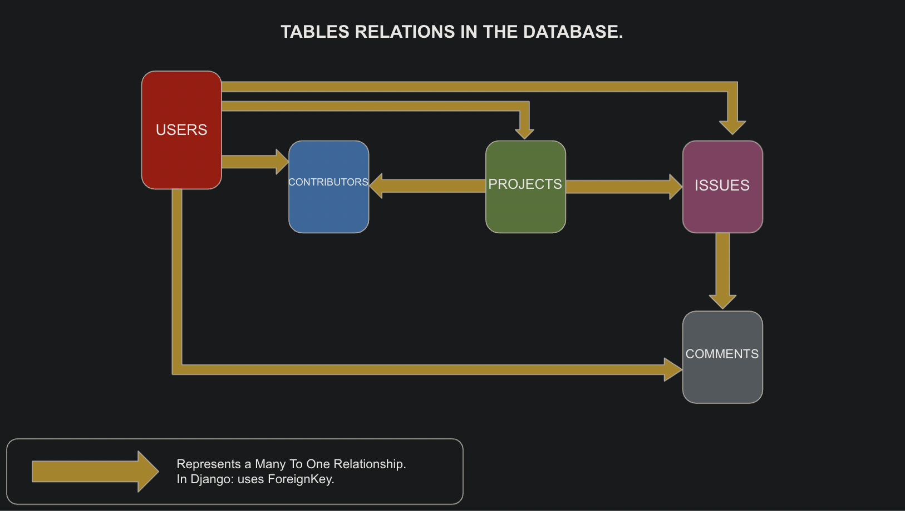
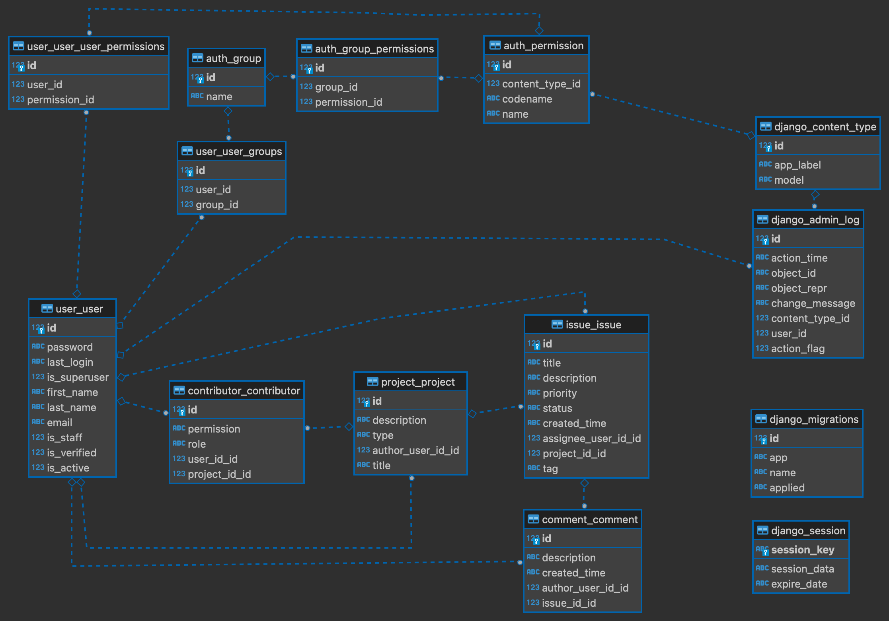

# Project 10: SoftDesk / Create a secured API with DRF

[](https://www.python.org/downloads/release/python-392/)
[](https://docs.djangoproject.com/en/3.2/releases/3.2.8/)
[](https://www.django-rest-framework.org/)
[](https://docs.djangoproject.com/en/3.2/intro/tutorial02/#database-setup)
[](https://django-rest-framework-simplejwt.readthedocs.io/en/latest/)  

For any informations feel free to [contact me](mailto:raphael.49410@gmail.com?Subject=GDPR_api_softDesk) or [](https://twitter.com/RafaRemote)  

Menu

1. Usage
2. Endpoints
3. Entity–relationship model
4. Technologies
5. Installation
6. Execution of the program
7. flake8 report
8. Important information about the database
9. API Documentation
10. GDPR Compliance

## 1 - Usage  

API for an Issue Tracking System  
Anyone can sign up hence become a User then log in.  
  
**Only authenticated Users can consume the API.**  
  
User can create a project.  
Owner of the project can create/delete Project's Contributors.  
Contributors and Owner of a Project can create Project's Issues.  
Contributors and Owner of a Project can create Comment to Project's Issues.  
  
Only the Owner of a Project/Issue/Comment can update or delete it.  
Only the Owner of a Project can CRUD the Contributors related it.  
  
## 2 - Endpoints  
  
_(check the [POSTMAN Api documentation](https://documenter.getpostman.com/view/12917774/UVC2HpH6) for all the details)_
  
|  			<br># 		  	|  			<br>API Endpoint 	|  			<br>HTTP Method 	|  			<br>URI 		  	|
|---	|---	|---	|---	|
|  			<br>1. 		  	|  			<br>User Signup 	| POST 	|  			<br>/signup 		  	|
|  			<br>2. 		  	|  			<br>Create User 	|  			<br>POST 		  	|  			<br>/login 		  	|
|  			<br>3. 		  	|  			<br>Get all Projects of the connected Usser 	|  			<br>GET 		  	|  			<br>/projects 		  	|
|  			<br>4. 		  	|  			<br>Create Project 	| POST 	|  			<br>/projects 		  	|
|  			<br>5. 		  	|  			 		<br>Get Project details with its id  	|  			<br>GET 		  	|  			<br>/projects/{id} 		  	|
|  			<br>6. 		  	|  			<br>Update Project 	|  			<br>PUT 		  	|  			<br>/projects/{id} 		  	|
|  			<br>7. 		  	|  			<br>Delete Project and its issues 	|  			<br>DELETE 		  	|  			<br>/projects/{id} 		  	|
|  			<br>8. 		  	|  			<br>Create a Contributor to a project 	|  			<br>POST 		  	|  			<br>/projects/{id}/users 		  	|
|  			<br>9. 		  	|  			<br>Get all the Contributors of a Project 	|  			<br>GET 		  	|  			<br>/projects/{id}/users 		  	|
|  			<br>10. 		  	|  			<br>Delete a Contributor 	|  			<br>DELETE 		  	|  			<br>/projects/{id}/users/{id} 		  	|
|  			<br>11. 		  	|  			<br>Get all the Issues of a Project 	|  			<br>GET 		  	|  			<br>/projects/{id}/issues 		  	|
|  			<br>12. 		  	|  			<br>Create a Project's Issue 	|  			<br>POST 		  	|  			<br>/projects/{id}/issues 		  	|
|  			<br>13. 		  	|  			<br>Update a Project's Issue 	|  			<br>PUT 		  	|  			<br>/projects/{id}/issues/{id} 		  	|
|  			<br>14. 		  	|  			<br>Delete a Project's Issue 	|  			<br>DELETE 		  	|  			<br>/projects/{id}/issues/{id} 		  	|
|  			<br>15. 		  	|  			<br>Create an Issue's Comment 	|  			<br>POST 		  	|  			<br>/projects/{id}/issues/{id}/comments 		  	|
|  			<br>16. 		  	|  			<br>Get all the Comments of an Issue 	|  			<br>GET 		  	|  			<br>/projects/{id}/issues/{id}/comments 		  	|
|  			<br>17. 		  	|  			<br>Update a Comment 	|  			<br>PUT 		  	|  			<br>/projects/{id}/issues/{id}/comments/{id} 		  	|
|  			<br>18. 		  	|  			<br>Delete a Comment 	|  			<br>DELETE 		  	|  			<br>/projects/{id}/issues/{id}/comments/{id} 		  	|
|  			<br>19. 		  	| Get a Comment with its id 	|  			<br>GET 		  	|  			<br>/projects/{id}/issues/{id}/comments/{id} 		  	|  
  
## 3 - Entity–relationship model  
  
### simplified view  
  

  
### detailed view  

Automatically generated from the file 'db.sqlite3' with the database tool:   


  
## 4 - Technologies
  
Programming language:   

Frameworks:  
  

Database:   

Security:   

## 5 - Installation MacOS / Windows
  
Default installation is for MacOS. There is some little differences for Windows, follow the given details below.  
You need to have Python installed on your machine. [install python](https://www.python.org/downloads/)  
You need to have Git installed on your machine. [install git](https://git-scm.com/book/en/v2/Getting-Started-Installing-Git)  
  
Open a terminal wherever you want then follow these steps:  
(you can copy/paste the whole blocks)

```python
git clone https://github.com/RafaRemote/DAPY_P10_softDesk.git
```
  
Open the folder DAPY_P10_softDesk that you just cloned, then copy/paste the whole block below, it will:  

1. create a virtual environment with [https://img.shields.io/badge/virtual%20environment-venv-yellow](https://docs.python.org/3/library/venv.html#module-venv) 
2. activate the virtual environment
3. upgrade your version of pip inside the virtual environment
4. install all the requirements from the file requirements.txt, inside the virtual environment
(you can check the list of installed requirements.txt typing 'pip list' in your terminal)
  
```python
python -m venv env
source env/bin/activate
pip install --upgrade pip
pip install -r requirements.txt
```

### _commands for Windows_
  
```python
git clone https://github.com/RafaRemote/DAPY_P10_softDesk.git
cd DAPY_P10_softDesk
py -m venv env
env\Scripts\activate  
pip install --upgrade pip
pip install -r requirements.txt
```

---> **Check the version of your interpreter. It must be for python 3.9.2**

## 6 - Execution of the program

From the terminal, be sure to be in the root folder (named 'DAPY_P10_softDesk'), then follow this steps, it will:  

1. create and populate a database: 'db.sqlite3'. Is is the default database installed by Django, documentation => [](https://docs.djangoproject.com/en/3.2/intro/tutorial02/#database-setup) 
2. start the server at url:  'http://127.0.0.1:8000/'  

```python
python manage.py migrate  
python manage.py runserver  
```

## 7 - POSTMAN API Documentation

[postman api documentation](https://documenter.getpostman.com/view/12917774/UVC2HpH6)

## 8 - Important information about the database

The database is empty.  

If you want to create a superuser to access the default Django adminstration page, follow these instructions:

Open a second terminal. (first one is running the script) and think to activate the virtual environment as precised above.  
  
Type:

```python
python manage.py createsuperuser
```

Follow the instructions, once the superuser created you can access the default Django adminstration page and log in with your freshly created credentials @ [http:127.0.0.1:8000/admin/](http://127.0.0.1:8000/admin/).  
  
## 9 - Code consistency / PEP8 Compliance: flake8
  
To check the code consistency you can run flake8-html wich is a dependency of this project. (check requirements.txt)
To generate a report:  

be sure to be in the root folder, then type:  

```python
flake8 --format=html --htmldir=flake8_report
```

In the root folder, a folder named "flake8_report.html" will be generated, you can open it to check if there is flake8 violatons.
  
## 10 - GDPR Compliance
  
Private data kept in the database are the following:  
  
| data       |
|------------|
| first name |
| last name  |
| email      |
  
Usage of the private data: the email address is used as a unique identifier for authentication purpose.  
  
### Security
  
Authentication does use the JSON Web Tokens.  
Authorizations are set to access the objects.  
Passwords are encrypted in the database.  
Throttling Policy is set up globally for the project.  
API does not send errror messages with details.  
Data retention to be determined.  
Version Control System: Git.  
  
If any questions about the protection of the GDPR [contact us](mailto:raphael.49410@gmail.com?Subject=GDPR_api_softDesk) or [](https://twitter.com/RafaRemote)  
  